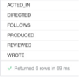
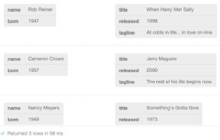
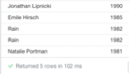
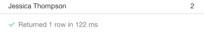
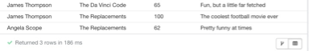
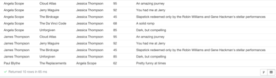

////
NO CAMBIAR!!
Codificación, idioma, tabla de contenidos, tipo de documento
////
:encoding: utf-8
:lang: es
:toc: right
:toc-title: Tabla de contenidos
:doctype: book
:linkattrs:

////
Nombre y título del trabajo
////
# Lab 05 Bases de datos a gran escala. Consultas en Neo4j. Máster en Tecnologías y Aplicaciones en Ingeniería Informática
Manuel Torres <mtorres@ual.es>

image::../../images/di.png[]

// NO CAMBIAR!! (Entrar en modo no numerado de apartados)
:numbered!: 

[abstract]
== Resumen
////
COLOCA A CONTINUACION EL RESUMEN
////
En este laboratorio se practica con el Cypher en Neo4j. Se practicará con operaciones habituales y básicas sobre la base de datos de ejemplo que incorpora la instalación de Neo4j.

////
COLOCA A CONTINUACION LOS OBJETIVOS
////
.Objetivos
* Usar la estructura básica de una consulta Cypher.
* Usar operaciones de modificación de la base de datos.

.Prerrequisitos
****
* Tener configurado el entorno de desarrollo de la asignatura.
****

// Entrar en modo numerado de apartados
:numbered:

## Recursos

Puedes obtener más información sobre cómo trabajar con Cypher en Neo4j siguiendo estos tutoriales:

* https://neo4j.com/developer/cypher/guide-cypher-basics/[Getting Started with Cypher - Neo4j]
* https://vladbatushkov.medium.com/learn-neo4j-cypher-basics-in-30-minutes-94d68a52544[Learn Neo4j Cypher basics in 30 minutes]

## Actividades

. Escribir una consulta que devuelva un listado alfabético de todas las relaciones que hay definidas en la base de datos
+

. Escribir una consulta que devuelva las personas que han participado como productores y directores de una película. Mostrar los nodos de las personas y los de las películas
+

. Escribir una consulta que devuelva los nombres y año de nacimiento de los cinco actores más jóvenes sin contar los que tienen la edad a `NULL` (El tratamiento de `NULL` es similar al de SQL)
+

 
. Escribir una consulta que devuelva el nombre del actor más joven, fecha de nacimiento, junto con el título y director de la película en la que aparecía.
+

 
. Escribir una consulta que siguiendo la relación `FOLLOWS` devuelva quién es la persona más seguida. Mostrar su nombre y el número de personas que la siguen
+

 
. Escribir una consulta que siguiendo la relación `FOLLOWS` devuelva  para cada persona una lista de personas a las que podrían seguir basándose en lo siguiente:
    .. Sugerirles las personas a las que siguen las personas a las que sigue cada uno de ellos (es decir, sugerir de forma transitiva).
    .. No sugerirles que sigan a una persona a la que ya siguen.
+

. Escribir una consulta que utilice la relación `WROTE` para obtener compañeros de reparto de `Tom Cruise` en películas que hayan sido escritas (relación `WROTE`) por guionistas nacidos antes de 1950. Devolver el reparto en una lista.
+

 
. Escribir una consulta que devuelva a `Jessica Thomson` con las revisiones que han hecho otras personas de las películas que ella ha revisado. Mostrar el listado ordenado por película, y para cada película mostrar primero las películas mejor valoradas
+

 
. Escribir una consulta que devuelva para cada persona una lista de películas sugeridas para revisar. La lista se obtiene a partir de las películas que han revisado las personas a las que siguen. Si una película sugerida ya ha sido revisada por una persona, no se le presentará en las sugerencias. El listado se mostrará ordenado por persona, y mostrará el título de la película sugerida, la persona que ha hecho la revisión, el rating de la revisión y la valoración (`summary`) que ha realizado.
+

 
. Eliminar todos los caminos de la base de datos
